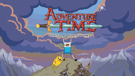

# 2023.2-Grupo01-StardewValley

  

Repositório para desenvolvimento de um MUD inspirado em Hora de Aventura da disciplina de SBD1 - 2024.1

## Alunos

| Nome | Matrícula |
| ---- | --------- |
| [Lucas Macedo](https://github.com/Luckx98) | 19/0091720 |

| [Luana de Lima Medeiros ](https://github.com/LuaMedeiros) || 19/0091444 |

| [Ciro Costa de Araujo](https://github.com/ciro-c) | 19/0011611 |

## Jogo

A história gira em torno de Lich, um vilão com cara de esqueleto que deseja acabar com o mundo todo, incluindo a Terra de Ooo. Finn, o humano, e Jake, o cão, recusam-se a deixar Lich acabar com aquilo que eles tanto amam. Para isso, lutam até ficar cansados. Mas isso ainda não é o suficiente. Então eles aprendem a importância do trabalho em equipe, fazendo com que os principais personagens de Hora de Aventura,  como Marceline e Princesa Jujuba, os ajudem em mais uma luta contra o mal.

## Apresentações

| Módulo | Link da gravação | Data |
| ------ | ---------------- | ---- |
| Módulo 1 |            |      |

## Entregas

- Módulo 1
 - [Modelo Entidade-Relacionamento](./docs/imagens/hora_de_aventura.png)  

### Histórico de versões

| Versão |	Data |	Descrição	| Autor |	Revisão |
| `1.0` |	18/07/2024 |	Criação do documento |	[Lucas Macedo](https://github.com/Luckx98)	|    |

### Referência

[1] - Resenha: Hora de Aventura – Edição Matemática, volume 1 | Turma do Fundão. Disponível em: <https://super.abril.com.br/coluna/turma-do-fundao/resenha-hora-de-aventura-8211-edicao-matematica-volume-1>. Acesso em: 19 jul. 2024.