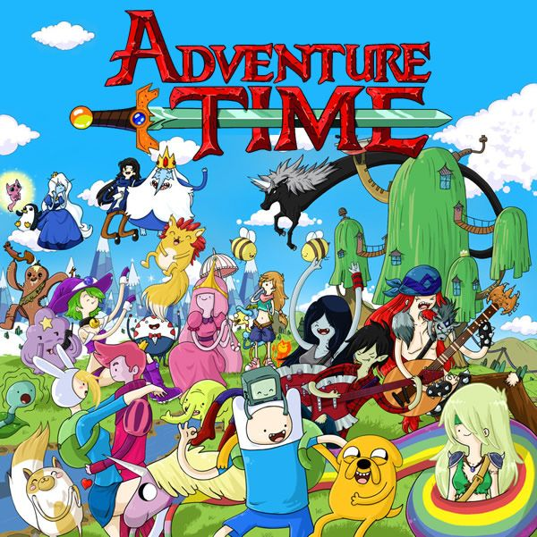

# 2024.1-Hora_de_Aventura

  

Repositório do trabalho sobre Hora de Aventura para a matéria de Bancos de Dados - 2024.1

## Alunos

| Nome                                                               | Matrícula |
| :----------------------------------------------------------------- | :-------: |
| [Ciro Gomes](https://github.com/) |  |
| [Lucas Macedo Barboza](https://github.com/Luckx98)                 |  |
| [Luana de Lima Medeiros](https://github.com/LuaMedeiros)           | 190091444 |

<table>
    <tbody><tr>
        <td align="center"><a href="https://github.com/Luckx98"> <b>Lucas Macedo</b></a> </td> 
              <td align="center"><a href="https://github.com/LuaMedeiros"> <b>Luana Medeiros</b></a> </td>  
    </tr> 
</tbody></table>

  

## Sobre o desenho

### Personagens Principais:
- Finn: Um jovem corajoso e aventureiro que veste um chapéu branco com orelhas. Ele é o último humano conhecido e sonha em ser um grande herói.
- Jake: Um cão mágico que é o melhor amigo e irmão adotivo de Finn. Ele tem a habilidade de esticar e mudar sua forma de várias maneiras.
- Princesa Jujuba: A governante do Reino Doce, uma cientista e criadora de muitos dos habitantes do seu reino.
- Rei Gelado: Um vilão trágico que usa uma coroa mágica que lhe dá poder, mas também o deixa mentalmente instável. Ele sequestra princesas na esperança de encontrar o amor.

### Resumo
"Hora de Aventura" é uma série de animação que segue as aventuras de Finn, um garoto humano, e seu melhor amigo Jake, um cachorro com poderes mágicos que pode mudar de forma e tamanho à vontade. Juntos, eles vivem na Terra de Ooo, um mundo pós-apocalíptico cheio de criaturas fantásticas e bizarras. Finn é um jovem corajoso e aventureiro que sonha em ser um grande herói, enquanto Jake é seu melhor amigo e irmão adotivo, com habilidades mágicas que os ajudam em suas jornadas. Eles são acompanhados por outros personagens memoráveis, como a Princesa Jujuba, a governante do Reino Doce e cientista criadora de muitos dos habitantes do seu reino, e o Rei Gelado, um vilão trágico que usa uma coroa mágica que lhe dá poder, mas também o deixa mentalmente instável.

A série aborda temas de aventura e amizade, destacando a importância da lealdade, ao mesmo tempo em que explora um mundo cheio de fantasia e magia. A Terra de Ooo está repleta de seres mágicos, reinos exóticos e mistérios que Finn e Jake desvendam ao longo de suas missões. Além das aventuras, a série também trata do crescimento e maturidade de Finn, que passa por várias experiências que o ajudam a entender mais sobre si mesmo e o mundo ao seu redor.

"Hora de Aventura" é conhecida por seu estilo de animação vibrante e colorido, com personagens e cenários criativos. A série combina humor leve e absurdo com temas profundos como identidade, perda e moralidade. Com uma narrativa serializada, a história evolui ao longo das temporadas, apresentando arcos de personagens complexos e desenvolvimento de trama contínuo. A série se tornou um fenômeno cultural, influenciando outras obras de animação e ganhando uma base de fãs dedicada, além de ser amplamente aclamada pela crítica por sua originalidade e criatividade. "Hora de Aventura" é uma mistura encantadora de aventuras épicas, comédia e momentos emocionantes, ambientada em um mundo mágico e peculiar que atrai tanto crianças quanto adultos, oferecendo algo único para cada espectador.

